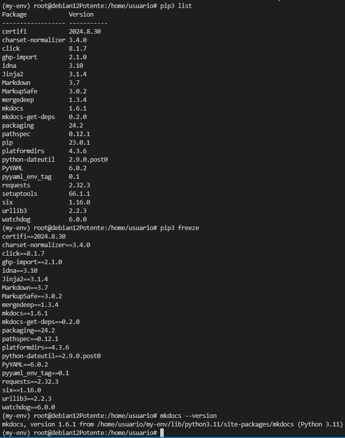
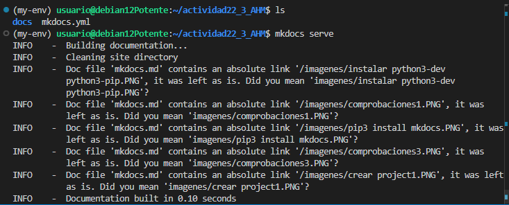
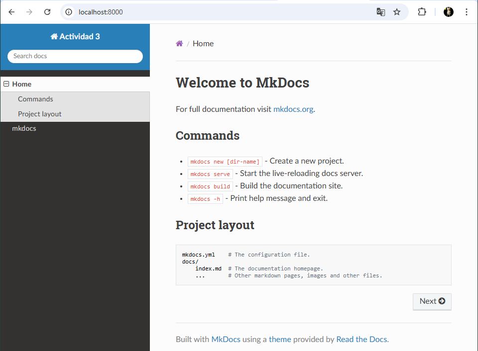

## 1. Actualizar el sistema

Es importante asegurarte de que tu sistema esté actualizado antes de instalar nuevos paquetes.

```sudo apt update```

---

## 2. Instalar Python

### Verificar si Python ya está instalado

Ejecuta el siguiente comando para comprobar si Python ya está instalado:

```python3 --version```
Si Python no está instalado, sigue estos pasos:
### Instalar Python 3

1. Instala Python 3 y sus herramientas:

    ```sudo apt install -y python3 python3-pip python3-venv```


2. Verifica la instalación:

    ```python3 --version
       pip3 --version```


---

## 3. Instalar MkDocs

### Usar `pip` para instalar MkDocs

1. Asegúrate de que `pip` esté actualizado:

    ```pip3 install --upgrade pip```

2. Instala MkDocs:

    ```pip3 install mkdocs```


3. Verificamos varias  la instalación:

    ```mkdocs --version```



---

## 4. Configuración inicial de MkDocs

### Crear un proyecto base de MkDocs

1. Crea un nuevo proyecto:

    ```mkdocs new my_project (Le ponemos el nombre que queramos)```


2. Cambia al directorio del proyecto:

    ```cd my_project```

3. Inicia el servidor de desarrollo de MkDocs:

    ```mkdocs serve 0.0.0.0:8000```



4. Abre tu navegador y accede a `http://127.0.0.1:8000` para ver tu sitio.


